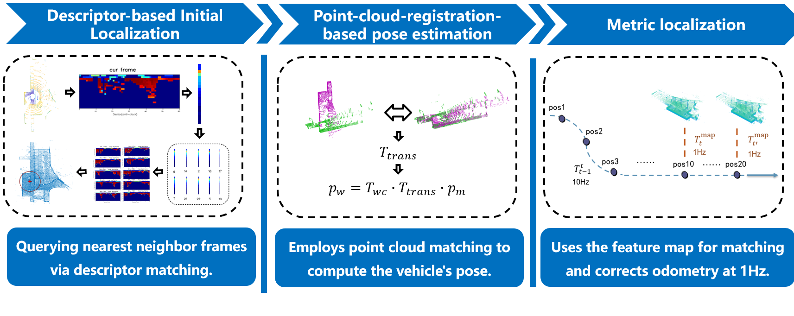

## 💫About Me

I am currently a first-year Ph.D. student in the Intelligent Transportation Thrust, Systems Hub, at [The Hong Kong University of Science and Technology (Guangzhou)](https://www.hkust-gz.edu.cn/), where I am a member of the [OMEGA Team](https://omega-hkustgz.github.io/) under the supervision of [Prof. Xinhu Zheng](https://facultyprofiles.hkust-gz.edu.cn/faculty-personal-page?id=168).
Before joining HKUST(GZ), I received my M.S.E. and B.E. degrees in Vehicle Engineering from [Tongji University](https://www.tongji.edu.cn/). During my master's studies, I conducted research on autonomous driving at the [TJ-IP Lab](https://github.com/TJ-IPLab/) under the supervision of [Prof. Lu Xiong](https://auto.tongji.edu.cn/info/1146/6330.htm).
My research interests include **World Action Models**, **Diffusion Models**, and **Multimodal Large Language Models**, with a particular focus on their applications to **Embodied AI** and **Autonomous Driving**.

&nbsp;

## 🔥News
**[2026/09]**  Began my Ph.D. studies at **HKUST(GZ)** in Guangzhou, China.    
**[2026/06]**  🎉 4DRadarGS has been accepted to **IROS 2026**. Congratulations to my collaborators!  
**[2026/04]**  Invited as a Reviewer for **International Conference on Intelligent Robots and Systems (IROS)**.  
**[2026/01]**  🎉 MSDNet — our follow-up work on R2LDM — has been accepted to **ICRA 2026**. Congratulations to my collaborators!    
**[2026/01]**  🎉 One paper on large-scale scene reconstruction has been accepted to **ICLR 2026**. Congratulations to my collaborators!    
**[2025/10]**  Invited as a Reviewer for **International Conference on Robotics and Automation (ICRA)**.    
**[2025/06]**  Invited as a Reviewer for **IEEE Robotics and Automation Letters (RA-L)**.    
**[2025/06]**  🎉 One paper on 4D radar super-resolution accepted to **IROS 2025**.        
**[2025/04]**  Started an internship at HKUST(GZ), Guangzhou, China.    
**[2024/12]**  Passed the mid-term evaluation of the master's program.    
**[2024/06]**  Published an invention patent on LiDAR place recognition.    
**[2023/09]**  Joined **TJ-IP Lab** at Tongji University to pursue my M.Sc. degree.    
**[2023/06]**  Awarded **"Excellent Graduate"** of Tongji University.    
**[2023/06]**  Graduated with a Bachelor's degree from Tongji University, Shanghai, China.    
 
&nbsp;

<!--  **[2025/06] [IROS 2025]** We proposed a novel diffusion-based framework for sparse 4D radar point cloud super-resolution, outperforming **state-of-the-art** baselines in 4D radar point cloud super-resolution and achieving up to **31.7%** improvement in point cloud registration recall rate and **24.9%** improvement in object detection accuracy. [[paper](https://arxiv.org/pdf/2503.17097v2)]   -->
 
<!--  One paper was submitted to IROS 2025. [[slides]] -->
<!-- **[2024/12]** Invited Talk at Princeton University. [[slides]](../files/Talk_princeton_zehan.pdf)    -->
<!-- **[2024/12]** Invited as a Reviewer for ICML. -->
<!-- &nbsp;   -->

## 📝Publications 
<!--

 -->
<!--

 -->
<!--**LiDAR4D: Dynamic Neural Fields for Novel Space-time View LiDAR Synthesis**   --> 
<!--**Zehan Zheng**, Fan Lu, Weiyi Xue, Guang Chen, Changjun Jiang.    -->
<!--**CVPR**, 2024   -->
<!--**[[Paper]](https://arxiv.org/abs/2404.02742) &#124; [[Code]](https://github.com/ispc-lab/LiDAR4D) &#124; [[Project Page]] --><!--(https://dyfcalid.github.io/LiDAR4D) &#124; [[Video]](https://www.youtube.com/watch?v=E6XyG3A3EZ8) &#124; [[Talk]]--><!--(https://www.bilibili.com/video/BV1Uy411Y766/?t=10870) &#124; [[Slides]]--><!--(https://drive.google.com/file/d/1Q6yTVGoBf_nfWR4rW9RcSGlxRMufmSXc/view?usp=sharing) &#124; [[Poster]]--><!--(https://drive.google.com/file/d/13cf0rSjCjGRyBsYOcQSa6Qf1Oe1a5QCy/view?usp=sharing)**   --><!--
Differentiable LiDAR-only framework for novel space-time LiDAR view synthesis, which reconstructs dynamic driving scenarios and --><!--generates realistic LiDAR point clouds end-to-end. It also supports simulation in the dynamic scene.  -->

<!--

   -->
<!--

   -->
<!--**A System and Method for LiDAR Relocalization Based on Fused Semantic Information Descriptors**      -->
<!--**Boyuan Zheng**, Guirong Zhuo, Lu Xiong.      -->
<!--A GNSS-free LiDAR localization solution comprising place recognition and metric localization modules. The system enhances matching success rates by generating virtual point   --><!--clouds and descriptors, achieving indoor localization accuracy within 10 cm.    -->

<!--
  -->
<!--
  -->

<table style="border: none; border-collapse: collapse;">

<tr style="border-collapse: separate; border-spacing:none;">
  <td style="border-collapse: collapse; border: none;">
    
  </td>
  <td style="border-collapse: collapse; border: none;">     
    "<i>R2LDM: An Efficient 4D Radar Super-Resolution Framework Leveraging Diffusion Model</i>"    
    <b>Boyuan Zheng</b>, Shouyi Lu, Renbo Huang, Minqing Huang, Fan Lu, Wei Tian, Guirong Zhuo, Lu Xiong. 
    <b> IROS 2025</b>
    
    
      <a href="https://arxiv.org/pdf/2503.17097">Arxiv</a>
      
      <a href="https://www.youtube.com/watch?v=p8hqg3TpJgE">Video</a>
      
      <a href="https://github.com/NathanDrake67/R2LDM">Github</a>
     
  </td>
</tr>

<tr style="border-collapse: separate; border-spacing:none;">
  <td style="border-collapse: collapse; border: none;">
    
  </td>
  <td style="border-collapse: collapse; border: none;">     
    "<i>MSDNet: Efficient 4D Radar Super-Resolution via Multi-Stage Distillation</i>"    
    Minqing Huang*, Shouyi Lu*, <b>Boyuan Zheng</b>, Ziyao Li, Xiao Tang, Guirong Zhuo. 
    <b> ICRA 2026</b>
    
    
      <a href="https://arxiv.org/abs/2509.13149">Arxiv</a>
     
  </td>
</tr>

<tr style="border-collapse: separate; border-spacing:none;">
  <td style="border-collapse: collapse; border: none;">
    
  </td>
  <td style="border-collapse: collapse; border: none;">     
    "<i>4DRadar-GS: Self-Supervised Dynamic Driving Scene Reconstruction with 4D Radar</i>"    
    Xiao Tang, Guirong Zhuo, Cong Wang, <b>Boyuan Zheng</b>, Minqing Huang, Lianqing Zheng, Long Chen, Shouyi Lu. 
    <b> IROS 2026</b>
    
    
      <a href="https://arxiv.org/abs/2509.12931">Arxiv</a>
     
  </td>
</tr>

<tr style="border-collapse: separate; border-spacing:none;">
  <td style="border-collapse: collapse; border: none;">
    
  </td>
  <td style="border-collapse: collapse; border: none;">     
    "<i>Multimodal Spatial Reasoning in the Large Model Era: A Survey and Benchmarks</i>"    
    Xu Zheng, Zihao Dongfang, Lutao Jiang, <b>Boyuan Zheng</b>, Yulong Guo, Zhenquan Zhang, Giuliano Albanese, Runyi Yang, Mengjiao Ma, Zixin Zhang, Chenfei Liao, Dingcheng Zhen, Yuanhuiyi Lyu, Yuqian Fu, Bin Ren, Linfeng Zhang, Danda Pani Paudel, Nicu Sebe, Luc Van Gool, Xuming Hu. 
    <b> Preprint 2025</b>
    
    
      <a href="https://arxiv.org/abs/2510.25760">Arxiv</a>
     
  </td>
</tr>

<tr style="border-collapse: separate; border-spacing:none;">
  <td style="border-collapse: collapse; border: none;">
    
  </td>
  <td style="border-collapse: collapse; border: none;">     
    "<i>Rethinking GCNs for the Traveling Salesman Problem: Are We Encoding Effectively ?</i>"    
    Junquan Huang*, <b>Boyuan Zheng*</b>, Jungang Li, Zihao Dongfang, Song Dai, Yubo Gao, Yu Huang, Xuming Hu, Zong-Gan Chen. 
    <b> Preprint 2025</b>
  </td>
</tr>

<tr style="border-collapse: separate; border-spacing: none;">
  <td style="border-collapse: collapse; border: none;">
    
  </td>
  <td style="border-collapse: collapse; border: none;">
    "<i>Signal Structure-Aware Gaussian Splatting for Large-Scale Scene Reconstruction</i>" 
    Weiyi Xue, Fan Lu, Chi Zhang, Tianhang Wang, Sanqing Qu, Zehan Zheng, <b>Boyuan Zheng</b>, Junqiao Zhao, Guang Chen. 
    <b>ICLR 2026</b>
    
    
      <a href="https://arxiv.org/abs/2607.01698">Arxiv</a>
      
      <a href="https://github.com/weiyixue999/Signal_Structure_Aware_Gaussian/">Github</a>
     
  </td>
</tr>

<tr style="border-collapse: separate; border-spacing:none;">
  <td style="border-collapse: collapse; border: none;">
    
  </td>
  <td style="border-collapse: collapse; border: none;">     
    "<i>A System and Method for LiDAR Relocalization Based on Fused Semantic Information Descriptors</i>"    
    <b>Boyuan Zheng</b>, Guirong Zhuo, Lu Xiong. 
    <b>Chinese Patent </b> CN202410446778.9, 2024. 

  </td>
</tr>

</table>

<!--        -->
<!--    <a href="https://arxiv.org/abs/2301.05219">Arxiv</a>     -->
<!--        -->
<!--    <a href="https://github.com/MingSun-Tse/Why-the-State-of-Pruning-so-Confusing">Code</a>     -->

## 💻Research Experience

- September 2026 - Present  
  **Ph.D. Student** - **Omnimodal Multi-Embodiment Generalist Agents Team [ (OMEGA) Team](https://omega-hkustgz.github.io/), The Hong Kong University of Science and Technology (Guangzhou)**  
  Advisor: [Prof. Xinhu Zheng](https://facultyprofiles.hkust-gz.edu.cn/faculty-personal-page?id=168)  
  Research interests: World Action Models, Multimodal Large Language Models, Embodied AI and Autonomous Driving

- July 2023 - June 2026  
  **Research Assistant** - **Tongji Integrated Positioning Lab ([TJ-IP Lab](https://github.com/TJ-IPLab/)), Tongji University**  
  Advisor: [Prof. Lu Xiong](https://auto.tongji.edu.cn/info/1146/6330.htm)     
  Research included: Diffusion Models, LiDAR SLAM, 4D Radar Perception and Super-Resolution

- April 2025 - September 2025  
  **Research Intern** - **NLP-MM Group, HKUST(GZ)**  
  Advisor: [Prof. Xuming Hu](https://xuminghu.github.io/) and [Dr. Xu Zheng](https://zhengxujosh.github.io/)    
  Research included: MLLMs, Embodied AI, Multimodal Spatial Reasoning 
  
&nbsp;

## 🛠️Engineering Experience
- 2019 - 2022  
  **Tongji University (Formula SAE) [DIAN Racing Team](http://www.dianracing.com/)** ⚡🏎️   
  Aerodynamics Designer  
  Achieve 1st in FSEC 2020  
  Best Design Report Award in FSEC 2020  

- 2021 - 2022  
**Tongji University (Formula SAE) [DIAN Driverless Team](http://www.dianracing.com/)** ⚡🏎️   
  Aerodynamics Designer & Perception Group Member  
  Achieve 3rd in FSAC 2021  
  Best Design Report Award in FSAC 2021 

&nbsp;   

## 🏆Honors and Awards
- Excellent Graduate of Tongji University, 2023
- Outstanding Student of Tongji University, 2021
- First Prize of Tongji University Scholarship (Top 5%), 2021, 2022
- National First Prize in Formula Student Electric China Competition (FSEC), 2020
- Undergraduate Freshman Scholarship of Tongji University (Top 3 in Hebei Province), 2018  

&nbsp;  
